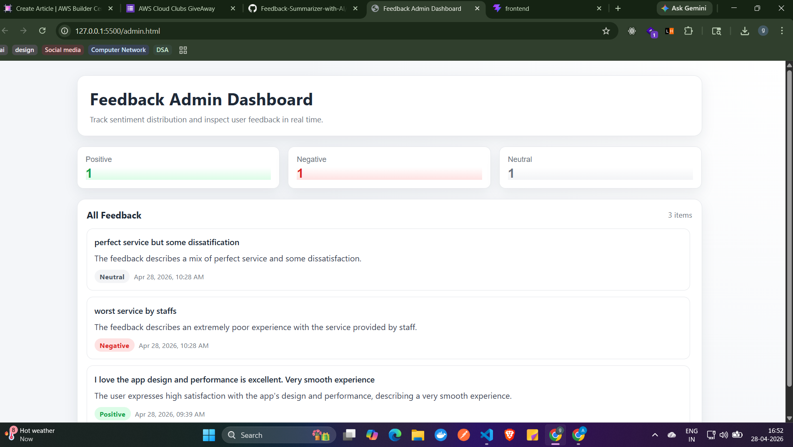

# Feedback Summarizer with AI

## Project Summary

Feedback Summarizer with AI is a project that helps collect written feedback and turn it into clear, short insights. Instead of reading many long comments one by one, the idea is to quickly understand what people are saying and the general mood behind it.

This project is focused on making feedback easier to review, easier to act on, and less time-consuming for teams.

## Purpose


## Current Scope


Note: The backend service is currently a work in progress and does not expose a completed endpoint yet.

## Typical User Flow

1. A user writes feedback.
2. The feedback is submitted through the app.
3. The project processes that feedback for a short summary and sentiment understanding.
4. The result is intended to help teams quickly understand what matters most.


## Why This Project Matters


## Future Direction


## License

No license file is currently included in this repository.

---

## Feedback Admin Dashboard

A responsive, production-ready admin interface for managing and analyzing collected feedback in real time.

### Overview

The Feedback Admin Dashboard provides teams with a unified view of all collected feedback, organized by sentiment analysis. It enables quick filtering, intuitive navigation, and immediate insights into user sentiment distribution without requiring any page reloads.



The dashboard displays real-time sentiment metrics and a scrollable list of all feedback items with their summaries, allowing administrators to quickly identify trends and prioritize responses based on sentiment categories.

### Key Features

#### 1. **Sentiment-Based Organization**
The dashboard automatically categorizes all feedback into three distinct sentiment buckets:
- **Positive Feedback** (Green) - Constructive and favorable comments
- **Negative Feedback** (Red) - Critical and problematic feedback
- **Neutral Feedback** (Gray) - Objective observations and general comments

Each category displays a live count of items within that sentiment group, making it easy to track sentiment distribution at a glance.

#### 2. **Interactive Category Filtering**
- Click any category card (Positive, Negative, or Neutral) to instantly filter the feedback list
- Click the active category again to return to the "All Feedback" view
- Smooth transitions and visual feedback indicate the current filter state
- No page reload required—filtering happens instantly on the client side

#### 3. **Rich Feedback Display**
Each feedback item in the list displays:
- **Feedback Text** - The original user comment
- **Summary** - AI-generated concise summary of the feedback
- **Sentiment Badge** - Visual indicator (color-coded by sentiment)
- **Timestamp** - Creation date and time in human-readable format

#### 4. **Smart Data Management**
- Feedback items are automatically sorted by most recent first
- Real-time count updates as data is fetched from the API
- Graceful handling of empty states with user-friendly messages
- Loading indicators during API calls for transparency
- Error recovery with retry functionality

### Technical Specifications

**File Location:** `admin.html` (Single-file solution with embedded HTML, CSS, and JavaScript)

**API Endpoint:**
```
GET https://4tn7afy6zb.execute-api.eu-north-1.amazonaws.com/default/Admin-feedback-summarizer
```

**Expected API Response Format:**
```json
{
  "total": 18,
  "positive_count": 10,
  "negative_count": 3,
  "neutral_count": 5,
  "positive": [
	 {
		"id": "uuid",
		"feedback": "User's original feedback text",
		"summary": "Concise AI-generated summary",
		"sentiment": "positive",
		"createdAt": "2026-04-28T12:30:00Z"
	 }
  ],
  "negative": [{ ... }],
  "neutral": [{ ... }]
}
```

### User Interface Design

**Layout Components:**
1. **Header Section** - Dashboard title and subtitle
2. **Category Cards Row** - Three clickable sentiment filter buttons with live counts
3. **Feedback List Section** - Scrollable container showing filtered feedback items

**Responsive Design:**
- Full desktop experience on screens 900px and wider
- Adapted single-column layout on mobile devices
- Optimized scrollable area for all screen sizes
- Touch-friendly button sizes for mobile interaction

**Color Scheme:**
- Positive: Green (#16a34a)
- Negative: Red (#dc2626)
- Neutral: Gray (#6b7280)
- Background: Light Gray (#f4f6f9)
- Cards: White (#ffffff)

### How to Use

1. **Access the Dashboard**
	- Open `admin.html` in any modern web browser
	- The dashboard will automatically load feedback data from the API on page load

2. **View All Feedback**
	- The default view displays all feedback items sorted by most recent
	- Scroll through the list to review all submissions

3. **Filter by Sentiment**
	- Click any category card (Positive, Negative, or Neutral) to view only that sentiment type
	- The count badges update dynamically to show how many items are in each category
	- Click an active category again to return to the full feedback view

4. **Review Individual Items**
	- Each feedback card displays the original text, AI-generated summary, sentiment label, and timestamp
	- Hover over cards for subtle visual feedback indicating interactivity

### Features Under the Hood

- **Pure Vanilla JavaScript** - No frameworks or external dependencies required
- **Async/Await API Integration** - Non-blocking data fetching with proper error handling
- **Event Delegation** - Efficient event listener management for category filters
- **HTML Sanitization** - XSS protection through proper HTML escaping
- **Localized Date Formatting** - Timestamps displayed in user's local timezone
- **Accessibility** - ARIA labels, semantic HTML, and keyboard-navigable interface
- **Loading States** - Spinner animation and retry mechanism for failed requests

### Production Readiness

✓ Single self-contained file (no build process needed)
✓ Cross-browser compatible
✓ Secure input handling and XSS prevention
✓ Responsive and mobile-friendly
✓ Professional UI with smooth animations
✓ Error handling and user feedback
✓ Performance optimized with minimal repaints
✓ Accessibility compliant
✓ Well-commented, readable code

## License

No license file is currently included in this repository.
