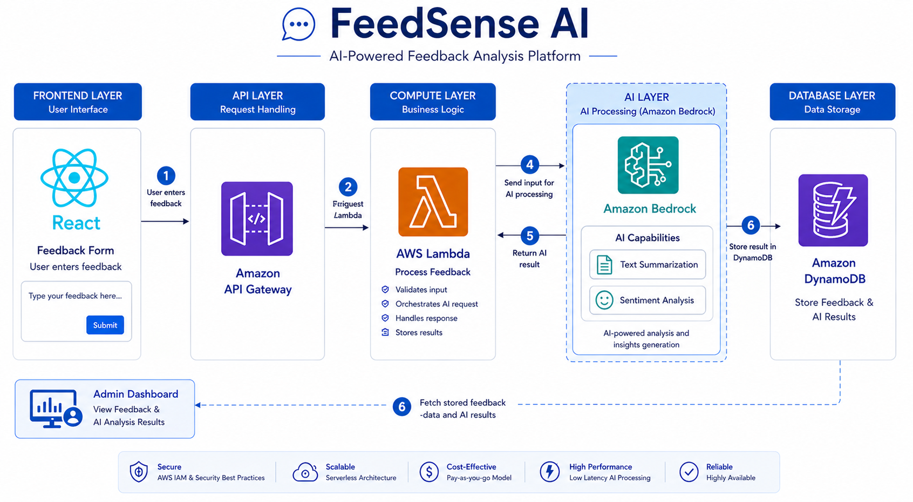
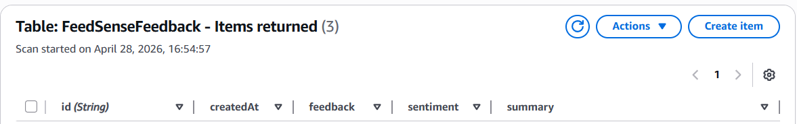
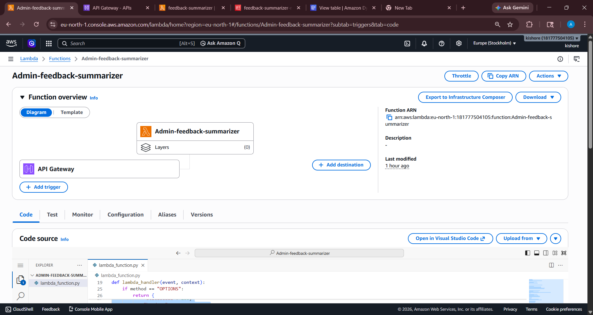
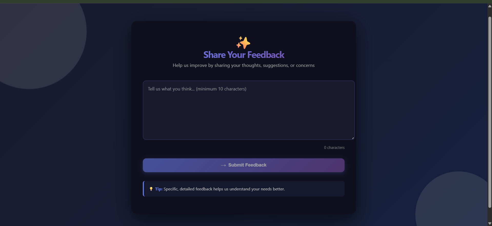
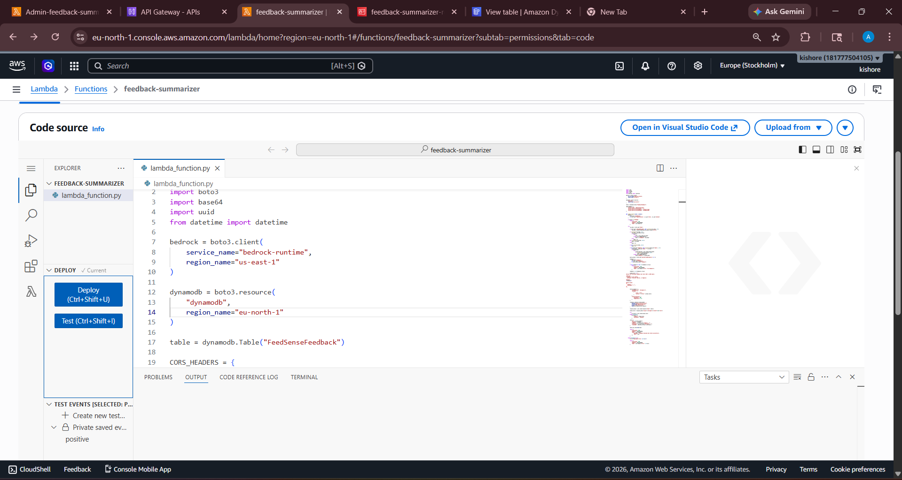

# Feedback Summarizer with AI

Feedback Summarizer with AI is a full-stack feedback collection and analysis project. It lets users submit written feedback, sends that feedback to an AI-powered backend for summarization and sentiment analysis, stores or reads results from DynamoDB, and provides an admin dashboard for reviewing feedback by sentiment.

## Project Overview

The project currently has three main surfaces:

- A React frontend for collecting feedback from users.
- A Python AWS Lambda backend for generating summaries and sentiment.
- A standalone Admin Dashboard for viewing feedback records and filtering them by sentiment.

The current user flow is:

1. A user enters feedback in the React form.
2. The frontend submits the feedback to the POST API.
3. The backend sends the feedback to Amazon Bedrock for AI analysis.
4. The feedback data is available for admin review through the GET API and dashboard.
5. The admin dashboard shows Positive, Negative, and Neutral feedback cards with counts.

## Project Structure

- `frontend/` - React + Vite user interface for submitting feedback.
- `backend/lambda.py` - POST Lambda that analyzes feedback with Amazon Bedrock.
- `backend/admin.py` - GET Lambda that reads categorized feedback from DynamoDB.
- `admin.html` - Single-file admin dashboard built with HTML, CSS, and JavaScript.
- `image/` - Project screenshots and architecture diagrams.

## Frontend

The frontend is a React app built with Vite. It currently renders the `Input` component, which provides the user feedback form.

### What the form does

- Accepts user feedback text.
- Shows a live character counter.
- Displays loading, success, and error states.
- Submits the feedback with Axios.
- Uses a minimum feedback length of 10 characters.

### Frontend API endpoint

The form submits feedback to:

```text
POST https://8ur8lkoioe.execute-api.us-east-1.amazonaws.com/deploy
```

### Frontend implementation notes

- `frontend/src/App.jsx` renders the `Input` component.
- `frontend/src/components/Input.jsx` handles form state, submission, and notifications.
- `frontend/src/components/Input.css` contains the feedback form styling.
- `frontend/src/App.css` and `frontend/src/index.css` support the overall app styling.

### Run the frontend locally

```bash
cd frontend
npm install
npm run dev
```

## Backend

The backend uses AWS Lambda and boto3.

### `backend/lambda.py`

This Lambda:

- Accepts feedback in the request body.
- Handles `OPTIONS` requests for CORS.
- Normalizes raw JSON or plain text input.
- Sends a prompt to Amazon Bedrock Nova Micro.
- Returns a JSON response containing the AI-generated result.

### Bedrock behavior

The backend prompt requests:

- A short summary
- A sentiment label: Positive, Neutral, or Negative

### `backend/admin.py`

This Lambda:

- Reads from the DynamoDB table `FeedSenseFeedback`.
- Scans stored feedback records.
- Groups items into positive, negative, and neutral buckets.
- Returns counts and categorized arrays in a dashboard-friendly response.

### Admin API endpoint

The admin dashboard expects:

```text
GET https://4tn7afy6zb.execute-api.eu-north-1.amazonaws.com/default/Admin-feedback-summarizer
```

### Expected admin response shape

```json
{
  "total": 3,
  "positive_count": 1,
  "negative_count": 1,
  "neutral_count": 1,
  "positive": [],
  "negative": [],
  "neutral": []
}
```

## Admin Dashboard

The admin dashboard is a single-file HTML page in `admin.html`. It is designed for quick review of categorized feedback without any build step.

### Features

- Displays three clickable sentiment cards.
- Shows the current count for Positive, Negative, and Neutral feedback.
- Filters feedback instantly when a category card is clicked.
- Defaults to showing all feedback items on page load.
- Displays each feedback item with text, summary, sentiment, and created date.
- Shows a loading state while fetching data.
- Shows an error state with retry support if the API request fails.
- Uses responsive layout, rounded cards, hover effects, and smooth transitions.

### Dashboard styling

- Background: `#f4f6f9`
- Cards: white
- Positive: green
- Negative: red
- Neutral: gray

### How the dashboard works

1. The page loads and fetches feedback from the admin API.
2. The response is split into positive, negative, and neutral arrays.
3. The dashboard builds a combined list for the default All Feedback view.
4. Clicking a category card changes the active filter without reloading the page.
5. Clicking the active card again returns to the full list.

### Open the dashboard

Open `admin.html` directly in a browser or serve it from a local static server.

## Images

The repository includes several images that document the product, architecture, and UI. They are referenced below in context so the README acts as the main project guide.

### Architecture and system flow

The main architecture diagram is shown here:



The database structure and storage model are shown here:



The backend processing logic is shown here:



### User interface screenshots

The user feedback form is shown here:



The summarized feedback view is shown here:



The admin dashboard UI is shown here:


## API Summary

### 1. Submit feedback

```text
POST https://8ur8lkoioe.execute-api.us-east-1.amazonaws.com/deploy
```

Used by the frontend feedback form.

### 2. View admin feedback

```text
GET https://4tn7afy6zb.execute-api.eu-north-1.amazonaws.com/default/Admin-feedback-summarizer
```

Used by the admin dashboard to load categorized feedback.

## Tech Stack

- React 19
- Vite
- Axios
- Python AWS Lambda
- Amazon Bedrock
- DynamoDB
- Vanilla HTML, CSS, and JavaScript for the admin dashboard

## Notes

- The frontend and admin dashboard are separate experiences.
- The frontend is the user-facing submission form.
- The admin dashboard is the review interface for sentiment-based analysis.
- If you replace either API endpoint, update both the code and this README.

## License

No license file is currently included in this repository.
